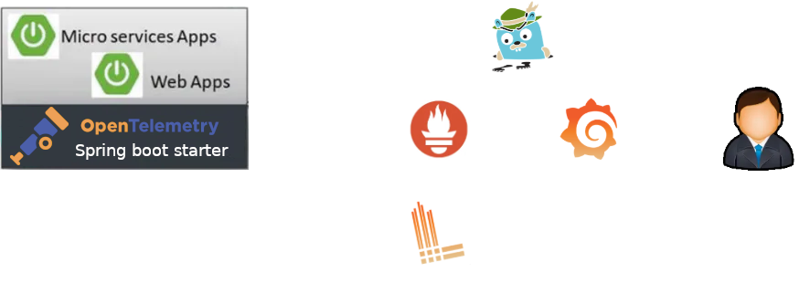

# Admin backend for frontend #

[](https://github.com/sjexpos/ecomm-admin-bff/releases/latest)
[](https://github.com/sjexpos/ecomm-admin-bff/actions?workflow=CI)
[](https://codecov.io/gh/sjexpos/ecomm-admin-bff)
[](https://github.com/sjexpos/ecomm-admin-bff/issues)
[](https://github.com/sjexpos/ecomm-admin-bff/commits/)

[](https://hub.docker.com/r/sjexposecomm/admin-bff)
[](https://hub.docker.com/r/sjexposecomm/admin-bff/tags)


This microservice is responsible for ...

## Framework

* [Spring Boot 3.3.2](https://spring.io/projects/spring-boot/)
* [Spring Cloud 2023.0.3](https://spring.io/projects/spring-cloud)
* [Spring Data 3.3.2](https://spring.io/projects/spring-data)
* [Openapi V3](https://swagger.io/specification/)
* [Hibernate 6.6](https://hibernate.org/orm/)
* [Hibernate Search 7.2.0](https://hibernate.org/search/)

## Observability

This project implements observability using OpenTelemetry Spring Boot starter
* traces: they are exported by the Spring Boot starter using [OpenTelemetry](https://opentelemetry.io) protocol (otlp on grpc). The receiver of the information is [Jaeger](https://www.jaegertracing.io/). In kubernetes, jaeger collector is used.
* metrics: they are exposed by the Spring Boot starter in a new port and endpoint to be scrapped by prometheus.
* logs: they are sent to console. In kubernetes, Loki pulls logs from pods.



OpenTelemetry collector receives oltp data and sends them to different exporters according to their type (metrics, traces, logs). Metrics are exposed to be pulled by prometheus. Traces are sent to Jaeger. And logs are sent to Loki.

## Requirements

* [Java 21](https://openjdk.org/install/)
* [Maven 3.8.8+](https://maven.apache.org/download.cgi)
* [AWS Cli](https://aws.amazon.com/es/cli/)
* [Docker](https://www.docker.com/)

## Build

```bash
mvn clean install
```

## Run Tests
```bash
mvn clean tests
```

## Runtime requeriments

* **users service** - it must be run on port 6061
* **products service** - it must be run on port 6062
* **orders service** - it must be run on port 6063

### Run application
```
./run.sh
```

### Debug application on port 5005
```
./debug.sh
```

## Swagger UI

http://localhost:5051/

