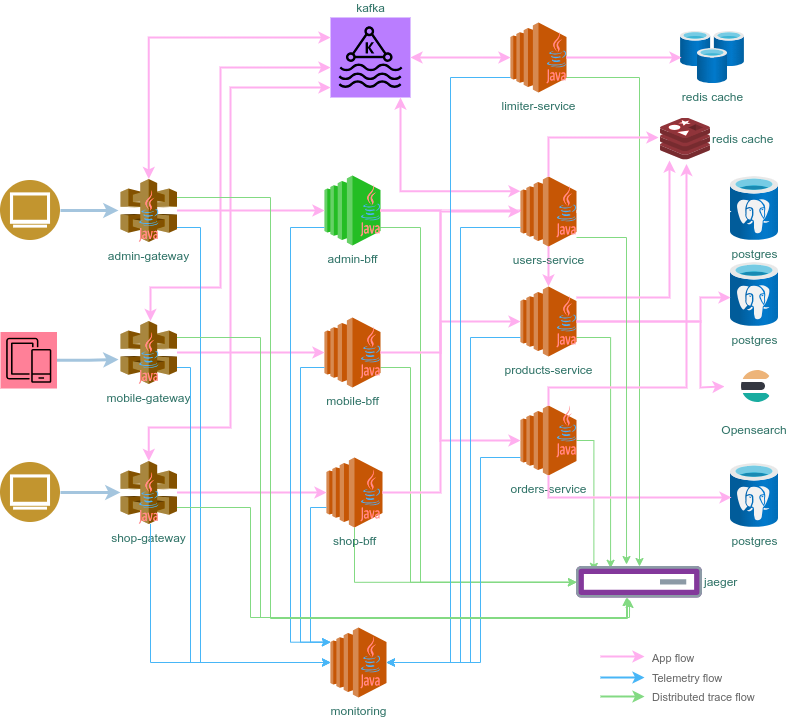

# Admin backend for frontend #

[](https://github.com/sjexpos/ecomm-admin-bff/releases/latest)
[](https://github.com/sjexpos/ecomm-admin-bff/actions?workflow=CI)
[](https://codecov.io/gh/sjexpos/ecomm-admin-bff)
[](https://github.com/sjexpos/ecomm-admin-bff/issues)
[](https://github.com/sjexpos/ecomm-admin-bff/commits/)



This microservice is responsible for ...

## Framework

* [Spring Boot 3.3.2](https://spring.io/projects/spring-boot/)
* [Spring Cloud 2023.0.3](https://spring.io/projects/spring-cloud)
* [Spring Data 3.3.2](https://spring.io/projects/spring-data)
* [Openapi V3](https://swagger.io/specification/)
* [Hibernate 6.6](https://hibernate.org/orm/)
* [Hibernate Search 7.2.0](https://hibernate.org/search/)

## Requirements

* [Java 21](https://openjdk.org/install/)
* [Maven 3.8.8+](https://maven.apache.org/download.cgi)
* [AWS Cli](https://aws.amazon.com/es/cli/)
* [Docker](https://www.docker.com/)

## Build

```bash
mvn clean install
```

## Run Tests
```bash
mvn clean tests
```

## Runtime requeriments

* **users service** - it must be run on port 6061
* **products service** - it must be run on port 6062
* **orders service** - it must be run on port 6063

### Run application
```
./run.sh
```

### Debug application on port 5005
```
./debug.sh
```

## Swagger UI

http://localhost:5051/

